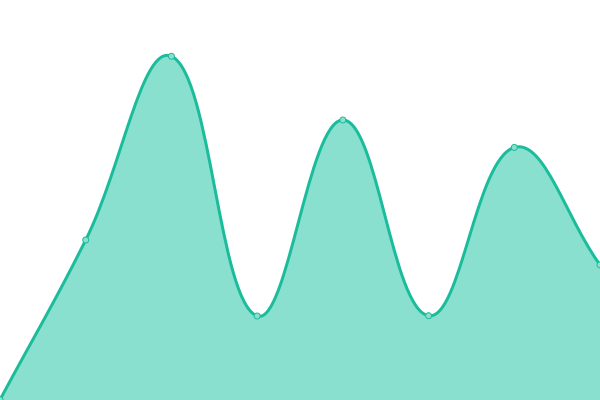

# [📈 Live Status](https://alxuy.github.io/upptime): <!--live status--> **🟧 Partial outage**

This repository contains the open-source uptime monitor and status page for [alxuy](https://alxuy.github.io/upptime), powered by [Upptime](https://github.com/upptime/upptime).

With [Upptime](https://upptime.js.org), you can get your own unlimited and free uptime monitor and status page, powered entirely by a GitHub repository. We use [Issues](https://github.com/alxuy/upptime/issues) as incident reports, [Actions](https://github.com/alxuy/upptime/actions) as uptime monitors, and [Pages](https://alxuy.github.io/upptime) for the status page.

<!--start: status pages-->
<!-- This summary is generated by Upptime (https://github.com/upptime/upptime) -->
<!-- Do not edit this manually, your changes will be overwritten -->
<!-- prettier-ignore -->
| URL | Status | History | Response Time | Uptime |
| --- | ------ | ------- | ------------- | ------ |
|  [Les Gîtes de Keregal](https://www.gites-keregal.com) | 🟩 Up | [les-gites-de-keregal.yml](https://github.com/alxuy/upptime/commits/HEAD/history/les-gites-de-keregal.yml) | 

 843ms
     
 | 

<a href="https://alxuy.github.io/upptime/history/les-gites-de-keregal">100.00%</a>
    

|  [Karat](https://karat-bijouterie.fr) | 🟩 Up | [karat.yml](https://github.com/alxuy/upptime/commits/HEAD/history/karat.yml) | 

 1047ms
     
 | 

<a href="https://alxuy.github.io/upptime/history/karat">100.00%</a>
    

|  [La gerbe d'or](https://lagerbedor92.fr) | 🟥 Down | [la-gerbe-d-or.yml](https://github.com/alxuy/upptime/commits/HEAD/history/la-gerbe-d-or.yml) | 

 500ms
     
 | 

<a href="https://alxuy.github.io/upptime/history/la-gerbe-d-or">0.00%</a>
    

|  [Amelie's workshop](https://ameliesworkshop.fr) | 🟩 Up | [amelie-s-workshop.yml](https://github.com/alxuy/upptime/commits/HEAD/history/amelie-s-workshop.yml) | 

 951ms
     
 | 

<a href="https://alxuy.github.io/upptime/history/amelie-s-workshop">99.41%</a>
    

|  [Angkor](https://angkor-fougeres.fr) | 🟩 Up | [angkor.yml](https://github.com/alxuy/upptime/commits/HEAD/history/angkor.yml) | 

 574ms
     
 | 

<a href="https://alxuy.github.io/upptime/history/angkor">100.00%</a>
    

|  [Intense parapente](https://www.intense-parapente.fr) | 🟩 Up | [intense-parapente.yml](https://github.com/alxuy/upptime/commits/HEAD/history/intense-parapente.yml) | 

 822ms
     
 | 

<a href="https://alxuy.github.io/upptime/history/intense-parapente">100.00%</a>
    

<!--end: status pages-->

[**Visit our status website →**](https://alxuy.github.io/upptime)

## 📄 License

- Powered by: [Upptime](https://github.com/upptime/upptime)
- Code: [MIT](./LICENSE) © [alxuy](https://alxuy.github.io/upptime)
- Data in the `./history` directory: [Open Database License](https://opendatacommons.org/licenses/odbl/1-0/)
